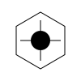

<div align="center">
  
  <h1>NeuralUI</h1>
  <p><strong>The UI library for Agentic AI and Crypto applications.</strong></p>
  <p>
    <a href="https://npmjs.org/package/neuralui"></a>
    <a href="https://npmjs.org/package/neuralui"></a>
    <a href="LICENSE"></a>
    
    
    
  </p>
  <p>
    <a href="https://neuralui.dev">Documentation</a> ·
    <a href="https://neuralui.dev/docs">Components</a> ·
    <a href="CHANGELOG.md">Changelog</a>
  </p>
</div>

---

NeuralUI is a collection of **54+ open-source, copy-paste UI components** built specifically for AI dashboards and cryptocurrency applications. Designed with a cinematic dark aesthetic, 60fps Framer Motion animations, and accessibility via Radix UI primitives.

## ✨ Why NeuralUI?

Unlike general-purpose libraries (shadcn, Material UI), NeuralUI is purpose-built for the **next generation of AI and crypto applications**:

- 🤖 **AI-native components** — `AIChatInterface`, `StreamingText`, `AgentThoughtFlow`, `AgentActivityFeed`, `ModelParameters`, `StepProcess`
- 🪙 **Crypto-native components** — `SwapCard`, `WalletConnectModal`, `PriceMetric`, `TokenPerformance`, `AddressBadge`
- 📊 **Data visualization** — `RadarChart`, `MiniSparkline`, `AnalyticsCard`, `NeuralDataTable`
- 🎬 **Cinematic aesthetics** — Glassmorphism, GPU-accelerated animations, premium dark mode

## 🚀 Quick Start

NeuralUI uses a **copy-paste model** (like shadcn/ui) — components are added directly to your codebase, giving you full ownership.

```bash
# Add a component to your project
npx neuralui@latest add neural-button

# Add multiple components at once
npx neuralui@latest add neural-input neural-badge neural-card
```

## 📦 Installation

### Prerequisites

- Node.js 18+
- Next.js 14+ (App Router)
- React 18+
- Tailwind CSS 3+

### 1. Install peer dependencies

```bash
npm install framer-motion lucide-react clsx tailwind-merge @radix-ui/react-dialog @radix-ui/react-switch @radix-ui/react-checkbox
```

### 2. Add the `cn` utility

Create `src/lib/utils.ts`:

```typescript
import { clsx, type ClassValue } from "clsx";
import { twMerge } from "tailwind-merge";

export function cn(...inputs: ClassValue[]) {
  return twMerge(clsx(inputs));
}
```

### 3. Add a component

```bash
npx neuralui@latest add neural-button
```

### 4. Use it

```tsx
import { NeuralButton } from "@/components/ui/core/NeuralButton";

export default function Page() {
  return (
    <NeuralButton variant="neon" size="lg">
      Initialize Core
    </NeuralButton>
  );
}
```

## 🧩 Component Categories

### Core Primitives
`NeuralButton` · `NeuralInput` · `NeuralCard` · `NeuralBadge` · `NeuralSelect` · `NeuralTabs` · `NeuralDialog` · `NeuralToaster` · `NeuralSwitch` · `NeuralCheckbox` · `NeuralSlider` · `NeuralProgress` · `NeuralTooltip` · `NeuralAlert` · `NeuralAvatar` · `NeuralAccordion` · `NeuralBreadcrumb` · `NeuralSkeleton` · `NeuralLoader` · `NeuralMarquee` · `NeuralOTPInput` · `NeuralPasswordInput` · `NeuralDatePicker` · `FileUploadZone` · `DragDropList` · `CustomScrollBar`

### AI Components
`AIChatInterface` · `StreamingText` · `AgentThoughtFlow` · `AgentActivityFeed` · `ModelParameters` · `StepProcess`

### Crypto Components
`SwapCard` · `WalletConnectModal` · `PriceMetric` · `TokenPerformance` · `AddressBadge`

### Data & Visualization
`RadarChart` · `MiniSparkline` · `AnalyticsCard` · `NeuralDataTable` · `CommandPalette` · `NeuralCodeEditor` · `NeuralExportButton`

### Effects & Patterns
`SpotlightCard` · `Magnetic` · `NeuralCommandBar` · `NeuralBentoGrid` · `NeuralCarousel`

## 🛠️ CLI Reference

```bash
# Add a specific component
npx neuralui@latest add <component-name>

# Examples
npx neuralui@latest add ai-chat-interface
npx neuralui@latest add swap-card
npx neuralui@latest add radar-chart
npx neuralui@latest add spotlight-card
```

## 🎨 Design System

NeuralUI is built on a consistent design language:

| Token | Value |
|-------|-------|
| **Primary accent** | Emerald 500 (`#10b981`) |
| **Background** | `#050505` / `#09090b` |
| **Monospace font** | JetBrains Mono |
| **UI font** | Inter |
| **Animation target** | 60fps GPU-accelerated |

All numerical values, currency, and timestamps automatically use `font-mono` with `tabular-nums`.

## 🤝 Contributing

Contributions are welcome! Please read our [Contributing Guide](CONTRIBUTING.md) first.

```bash
git clone https://github.com/yourusername/neuralui
cd neuralui
npm install
npm run dev
```

## 📄 License

MIT © [Neural Inc.](LICENSE)

---

<div align="center">
  <p>Built for the future of AI. ⚡</p>
  <a href="https://neuralui.dev">neuralui.dev</a>
</div>
